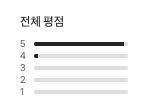
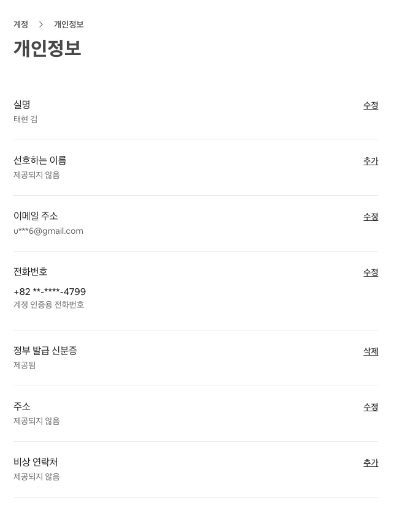
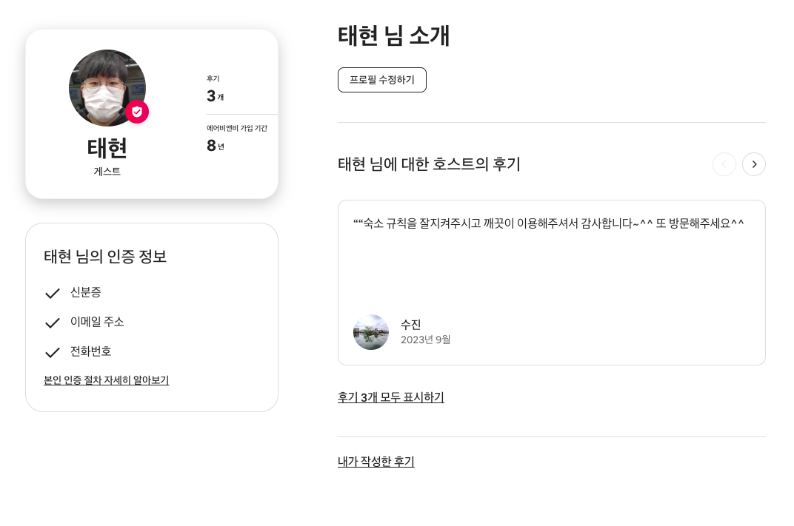
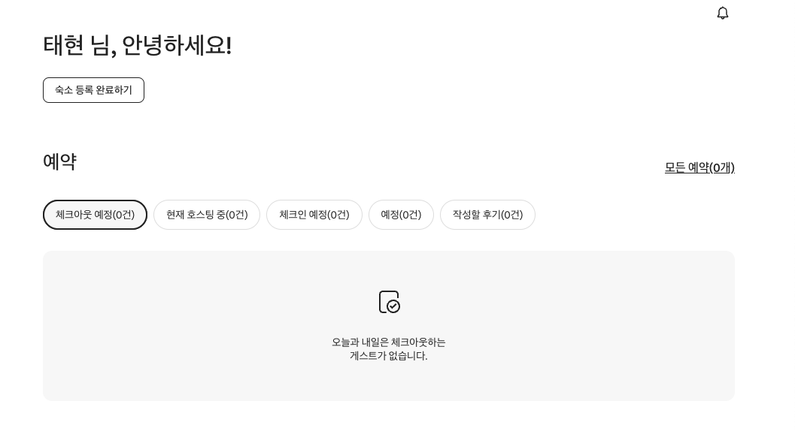
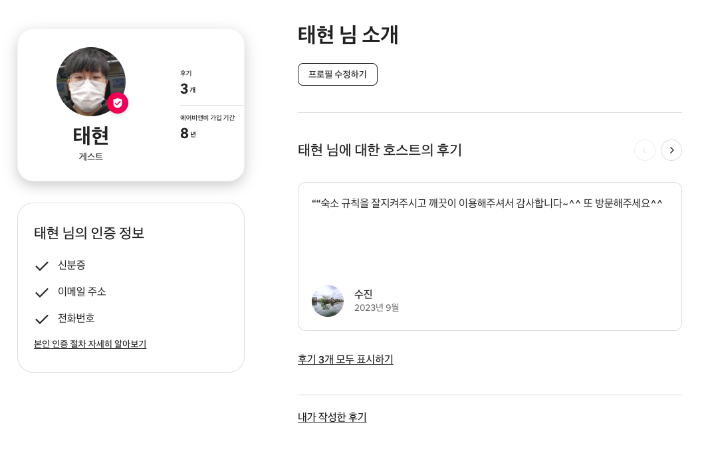

# Airbnb 클론 프로젝트 + SpringBoot

# 소개123

- Java와 SpringBoot를 기반으로 한 에어비앤비 클론코딩 프로젝트입니다.
- 기본적인 CRUD 기능 구현
- 위치 정보 표시, 숙소 검색, 예약, 리뷰 등의 핵심 기능 구현
- 사용자 인증 및 개인화 기능 (위시리스트 등) 구현

# 목표

- 철저히 서버 + 데이터베이스 중심
- 프론트는 기능의 동작을 확인할 수 있는 수준으로만 구현

# 일정

- 1주차(10/18 - 10/24) : 기본 CRUD (🍕)
- 2주차(10/25 - 10/31) : 심화 기능 (⭐)

# 기술 스택

- 백엔드: Java, SpringBoot
- 데이터베이스: MySQL
- ORM: JPA (선택)
- 인증: Spring Security (선택)
- API 문서화: Swagger (선택)
- 버전 관리: Git
- 빌드 도구: Gradle

# ERD

.png)

[https://www.erdcloud.com/d/sNAgeZD3L5cdpRNfS](https://www.erdcloud.com/d/sNAgeZD3L5cdpRNfS)

# Figma

[https://www.figma.com/design/R8sUYzYPq1eY1fyQP6oZIx/ssafy-db-project?node-id=201-5757&node-type=canvas&t=OrMbOwOHTx5UxIK4-0](https://www.figma.com/design/R8sUYzYPq1eY1fyQP6oZIx/ssafy-db-project?node-id=201-5757&node-type=canvas&t=OrMbOwOHTx5UxIK4-0)

# 기능 목록 (기본: 🍕, 심화: ⭐)

## `1. 메인 페이지`

### 1.1 숙소 목록 조회 및 표시 (🍕)

- **기능**: 추천 숙소 또는 최근 등록된 숙소 데이터를 목록으로 표시
- **구현 상세**:
    - 그리드 레이아웃으로 숙소 카드 표시 (한 페이지당 20개 숙소)
    - 각 숙소 카드에 기본 정보 표시
        - 대표 이미지
        - 제목
        - 가격
        - 평점
    - '페이지네이션' 버튼 클릭 시 추가 숙소 로드 ⭐
- **관련 테이블**: Room, RoomImage

### 1.2 숙소 유형별 필터링 (🍕)

- **기능**: 숙소 유형(카테고리)에 따라 숙소 목록 필터링
- **구현 상세**:
    - 페이지 상단에 가로 캐러셀로 카테고리 필터 버튼 구현
    - 선택된 카테고리에 따라 숙소 목록 실시간 업데이트
- **관련 테이블**: Category, Room

### 1.3 검색 바 (⭐)

- **기능**: 지역, 날짜, 인원 수 기반의 검색 기능 제공
- **구현 상세**:
    - 여행지: 검색창, 국가 or 도시 단위, *(선택) 자동완성 기능*
    - 체크인 & 체크아웃: 달력 컴포넌트로 체크인/체크아웃 날짜 선택
        - 디자인 없이 체크인 달력, 체크아웃 달력 2개 뜨고, 양쪽에서 클릭한 날짜로 입력
    - 여행자: 인원 수 선택 드롭다운 메뉴 구현
- **관련 테이블**: Location, Country

### 1.4 위시리스트 추가 (🍕/⭐)

- 기능: 어떤 위시리스트 그룹에 추가할 지 선택
- 구현 상세:
    - (기본) 가장 최근에 추가한 그룹에 즉시 추가 🍕
    - (심화) 숙소 카드에 배치된 위시리스트 토글 버튼을 클릭하면 모달 창 생성 ⭐
        - 위시리스트 그룹 리스트
        - 어떤 그룹에 추가할지 선택
        - 혹은 새로운 그룹 생성
            - 클릭하면 그룹명만 입력할 수 있는 form 태그
            - 취소하면 이전 모달창으로

## `2. 검색 결과 페이지`

### 2.1 검색 결과 표시 (⭐)

- **기능**: 검색 조건에 맞는 숙소 목록과 지도 동시 표시
- **구현 상세**:
    - 페이지를 좌우 분할 레이아웃으로 구성 (왼쪽: 숙소 목록, 오른쪽: 지도)
    - 지도에 검색 결과 숙소들의 위치를 마커로 표시
    - 페이지네이션으로 추가 결과 로드
- **관련 테이블**: Room, Location

### 2.2 인터랙티브 검색 결과 (⭐⭐)

- **기능**: 숙소 목록 항목에 마우스 오버 시 해당 숙소를 지도에서 강조
- **구현 상세**:
    - 마우스 오버된 숙소의 마커 크기 확대 및 색상 변경
    - *(선택) 마커 클릭 시 간단한 정보 팝업 표시*
- **관련 테이블**: Room

### 2.3 필터 및 정렬 옵션 (⭐⭐**)**

- **기능**: 검색 결과를 다양한 기준으로 필터링 및 정렬
- **구현 상세**:
    - 필터 옵션: 숙소 유형, *(선택) 가격 범위, (선택) 편의시설*
    - *(선택) 가격, 평점 등 다양한 기준으로 정렬 기능 구현*
- **관련 테이블**: Room, Category

## `3. 상세 정보 페이지`

### 3.1 숙소 상세 정보 표시 (🍕)

- **기능**: 선택한 숙소의 모든 정보를 상세히 표시
- **구현 상세**:
    - 이미지 갤러리 구현 (여러 장의 숙소 이미지 표시)
    - 숙소 설명, 호스트 정보, 지도, *(심화) 예약창*
- **관련 테이블**: Room, RoomImage, User (호스트 정보)

### 3.2 예약 기능 (⭐)

- **기능**: 선택한 숙소에 대한 예약 진행
- **구현 상세**:
    - 날짜 선택 달력 제공, (선택) 예약 가능한 날짜 표시
    - 인원 수 선택 옵션
    - 실시간 요금 계산 및 표시
    - 예약 확정 및 결제 연동
- **관련 테이블**: Room, Order

### 3.3 리뷰 섹션 (⭐)

- **기능**: 해당 숙소에 대한 이전 게스트의 리뷰 표시
- **구현 상세**:
    - 리뷰 정보: 작성자 이름, 별점, 작성일, 내용
    - *(선택) 전체 평점 분포도*
        
        
        
    - *(선택) 호스트의 답변 표시*
    - 리뷰 목록 페이지네이션으로 표시
- **관련 테이블**: Review, User

### 3.4 위치 정보 (🍕)

- **기능**: 숙소의 위치를 지도에 표시
- **구현 상세**:
    - Google Maps API를 이용해 숙소 위치 표시
    - *(선택) 주변 편의시설, 교통 정보 등 추가 정보 제공*
- **관련 테이블**: Room (latitude, longitude 필드 사용)

## `4. 사용자 정보 페이지`

### 4.1 개인정보 관리 (🍕)

- **기능**: 사용자 개인정보 조회 및 수정
- **구현 상세**:
    - 프로필 이미지 업로드/변경 기능
    - 개인정보 수정 폼 (이름, 전화번호, 이메일 등)
        
        
        
        
        
    - 비밀번호 변경 기능
- **관련 테이블**: User

### 4.2 예약 내역 (⭐)

- **기능**: 사용자의 과거 및 향후 예약 내역 표시
- **구현 상세**:
    - 예약 목록 표시 (날짜, 숙소 정보, 상태 등)
        - 체크인 예정(여행 전), 체크아웃 예정(여행 중), 작성할 후기(여행 완료)
        
        
        
- **관련 테이블**: Order, Room

### 4.3 리뷰 관리 (⭐)

- **기능**: 사용자가 작성한 리뷰 관리
- **구현 상세**:
    - 작성한 리뷰 목록 표시
        
        
        
    - 리뷰 수정 및 삭제 기능
- **관련 테이블**: Review, Order

## `5. 사용자 위시리스트 페이지`

### 5.1 위시리스트 그룹 관리 (🍕/⭐)

- **기능**: 사용자의 위시리스트 그룹 표시 및 관리
- **구현 상세**:
    - 위시리스트 그룹 목록 표시 (1개의 그룹만 사용하는 경우 🍕, 다중 그룹은 ⭐)
    - 새 그룹 생성, 그룹 삭제 기능
- **관련 테이블**: WishGroup, User

### 5.2 그룹별 숙소 목록 (⭐)

- **기능**: 각 위시리스트 그룹에 저장된 숙소 목록 표시
- **구현 상세**:
    - 그리드 또는 리스트 형태로 저장된 숙소 표시
    - 각 숙소 항목에 기본 정보 (이미지, 이름, 가격 등) 표시
    - 각 숙소 항목에 위시리스트 토글 버튼
        - 토글 OFF 시, 새로고침하면 위시리스트에서 제거
    - 숙소 클릭 시 해당 숙소의 상세 페이지로 이동
- **관련 테이블**: Wishlist, Room, RoomImage

# 깃 워크플로우

## 컨벤션

- 이슈 네이밍: `이슈 핵심 내용` (예: `구글 로그인 구현`)
- 브랜치 네이밍: `브랜치 종류/이슈 번호-개발할 기능 이름` (예: `feat/1-login`)
- 커밋 메시지: `(종류 이모지)[이슈 번호] 이슈 핵심 내용` (예: `[#11][#12] 구글 로그인 탈퇴시 발생하는 버그 해결`)
- PR 제목: `(종류 이모지)[이슈 번호] 커밋 내용` (예: `[#1] 로그인 화면 개발`)

## 커밋 종류

| 종류 | 설명 |
| --- | --- |
| initial | 초기 설정 |
| refactor | 파일·타입 이름 변경, 파일 분리 |
| bug | 버그 |
| feat | 기능 |
| gui | View |
| chore | SPM, 세팅, 빌드 등 |
| delete | 파일 삭제 |
| docs | 코드 외 문서 |
| asset | 에셋 |
| comment | 주석 |

## 깃 워크플로우

### 브랜치 생성

- 한 이슈당 브랜치 하나 1:1 관계 유지
- GitHub에서 Create a branch로 생성하거나 로컬에서 생성 후 push

### 작업 순서

### Push (작업 내용 보낼 때)

1. git add로 변경사항을 스테이징
2. git commit으로 로컬 저장소에 커밋
3. git pull로 원격 저장소 변경사항 확인 및 충돌 해결
4. git push로 원격 저장소에 변경사항 반영

### Pull Request

1. GitHub에서 PR 생성
2. PR 컨벤션에 따라 내용 작성
3. 코드 리뷰 및 승인 과정
4. 필요시 코드 수정
5. 병합 진행
6. 작업 완료된 원격 브랜치 삭제

### Pull (변경사항 받을 때)

1. git pull로 원격 저장소 변경사항 로컬에 반영
2. git branch -d로 이전 작업 브랜치 삭제
3. git branch와 git checkout으로 새 작업 브랜치 생성 및 전환

## 코드 리뷰

- 본인 외 1인의 승인 필요
- PR 제출 후 다음날 오전 10시까지 리뷰 완료 (주말 포함)

### 참고 자료
- SpringBoot 강의: https://inf.run/Hywa
- GitHub 강의(무료): https://codingapple.com/course/git-and-github/
